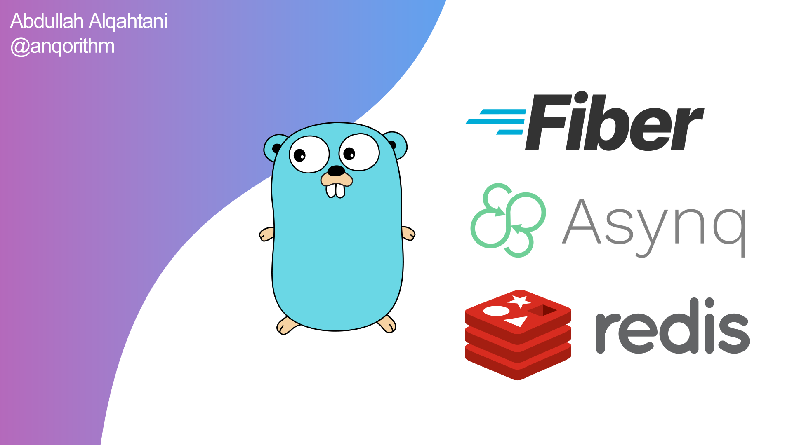

# image-processing-service-async



This repository contains an asynchronous image processing service built using Golang, Asynq, Redis, Fiber and Docker
Compose for easy deployment. To run the service, follow these steps:

1. Start the service containers using Docker Compose:
   ```bash
   docker-compose up -d
   ```

2. Run the server component:
   ```bash
   go run server/server.go
   ```

3. Run the worker component:
   ```bash
   go run worker/worker.go
   ```

4. Visit Asynqmon on port 8080 to monitor and manage asynchronous tasks.